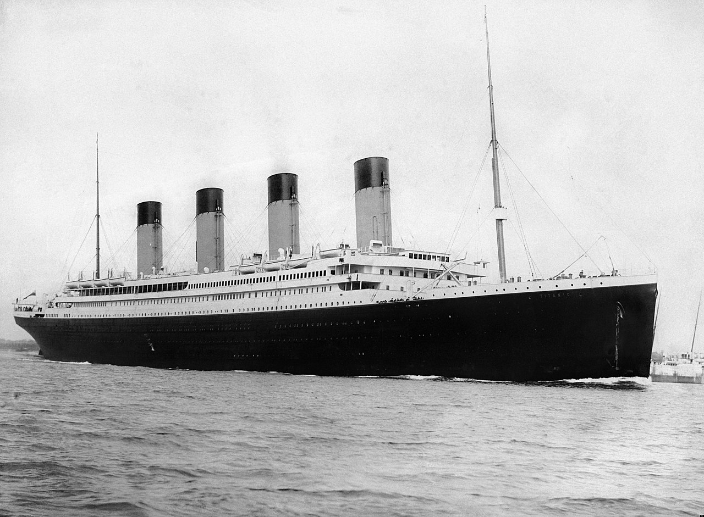
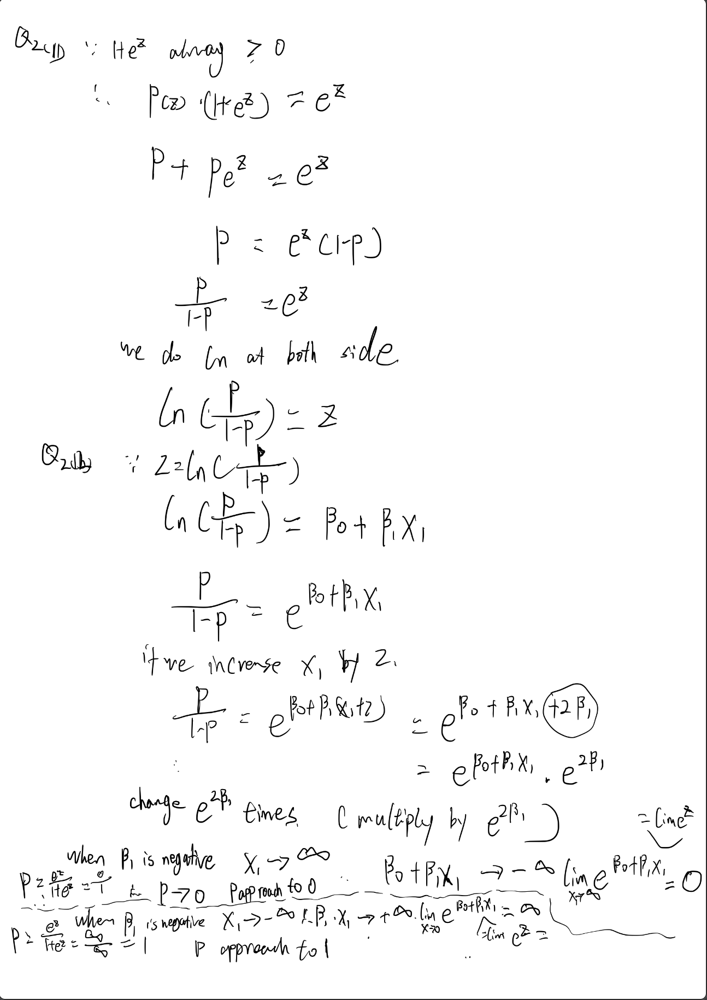

```{r setup, include=FALSE}
knitr::opts_chunk$set(echo = TRUE, message = FALSE,
                      warning = FALSE)
```

```{r data}
library(readr)
library(ggplot2)
library(tidyverse)
library(tidymodels)
library(corrplot)
library(ggthemes)
library(discrim)
library(poissonreg)
library(corrr)
library(klaR)
library(pROC)
tidymodels_prefer()
data = read_csv(file = 'data/titanic.csv')
data$survived <- factor(data$survived,levels = c('Yes','No'))
data$pclass <- factor(data$pclass)
data$sex <- factor(data$sex)
head(data)
```

## Classification

For this assignment, we will be working with part of a [Kaggle data set](https://www.kaggle.com/c/titanic/overview) that was the subject of a machine learning competition and is often used for practicing ML models. The goal is classification; specifically, to predict which passengers would survive the [Titanic shipwreck](https://en.wikipedia.org/wiki/Titanic).

{width="363"}

Load the data from `data/titanic.csv` into *R* and familiarize yourself with the variables it contains using the codebook (`data/titanic_codebook.txt`).

Notice that `survived` and `pclass` should be changed to factors. When changing `survived` to a factor, you may want to reorder the factor so that *"Yes"* is the first level.

Make sure you load the `tidyverse` and `tidymodels`!

*Remember that you'll need to set a seed at the beginning of the document to reproduce your results.*

### Question 1

Split the data, stratifying on the outcome variable, `survived.`  You should choose the proportions to split the data into. Verify that the training and testing data sets have the appropriate number of observations. Take a look at the training data and note any potential issues, such as missing data.

we verified the training and testing data sets have the appropriate number of observations by using row_train/(row_train+row_test) to get the proportions. it means the training dataset is 70% of the whole dataset, test dataset is 30% of the while dataset. 70% is corresponding to what we set in the initial_split function. By using sum(is.na), we know training dataset has missing data in variable embarked, age and cabin. 

Q:Why is it a good idea to use stratified sampling for this data?
 
A:it produces characteristics in the sample that are proportional to the overall population. It is easier to split the training and testing data base on proportion. 

```{r q1}
set.seed(3435)

titanic_split <- initial_split(data, prop = 0.70,
                                strata = survived)
titanic_train <- training(titanic_split)
titanic_test <- testing(titanic_split)
sum(is.na(titanic_train))
sum(is.na(titanic_train$passenger_id))
sum(is.na(titanic_train$survived))
sum(is.na(titanic_train$pclass))
sum(is.na(titanic_train$name))
sum(is.na(titanic_train$sex))
sum(is.na(titanic_train$age))
sum(is.na(titanic_train$sib_sp))
sum(is.na(titanic_train$parch))
sum(is.na(titanic_train$ticket))
sum(is.na(titanic_train$fare))
sum(is.na(titanic_train$cabin))
sum(is.na(titanic_train$embarked))
```


```{r q1.2}
row_train <-nrow(titanic_train)
row_test <- nrow(titanic_test)
row_train
row_test
row_train/(row_train+row_test)
```

### Question 2

Using the **training** data set, explore/describe the distribution of the outcome variable `survived`.

we can see the number of not survived is more than the number of survived.
```{r q2}

titanic_train %>% 
  ggplot(aes(x = survived)) +
  geom_bar()

```
### Question 3

Using the **training** data set, create a correlation matrix of all continuous variables. Create a visualization of the matrix, and describe any patterns you see. Are any predictors correlated with each other? Which ones, and in which direction?

Answer: I don't consider id as a numeric continous variable since it is just index
we see that sib_sq and parch have positive correlation with each other, and it’s only about 0.43. sib_sq and age have negative correlation with each other, and it's about -0.33. Because there is a missing value in age, we can plug corrplot to double check and comfirm. 
```{r q3}
library(corrplot)
cor_titanic <- titanic_train %>%
  select(-c(survived,name,pclass,sex,
            ticket,cabin,embarked,passenger_id)) %>%
  correlate()
rplot(cor_titanic)
cor_titanic %>%
  stretch() %>%
  ggplot(aes(x, y, fill = r)) +
  geom_tile() +
  geom_text(aes(label = as.character(fashion(r))))

titanic_train %>%
  dplyr::select(-c(survived,name,pclass,sex,
                   ticket,cabin,embarked,passenger_id)) %>% 
  cor(method = 'pearson', use = 'pairwise.complete.obs') %>% 
  corrplot(method = 'number')

```
### Question 4

Using the **training** data, create a recipe predicting the outcome variable `survived`. Include the following predictors: ticket class, sex, age, number of siblings or spouses aboard, number of parents or children aboard, and passenger fare.

Recall that there were missing values for `age`. To deal with this, add an imputation step using `step_impute_linear()`. Next, use `step_dummy()` to **dummy** encode categorical predictors. Finally, include interactions between:

-   Sex and passenger fare, and
-   Age and passenger fare.

You'll need to investigate the `tidymodels` documentation to find the appropriate step functions to use.

```{r q4}
fol <- recipe (survived ~ pclass + sex + age + sib_sp + parch + fare,titanic_train) %>% step_impute_linear(age) %>% step_dummy(all_nominal_predictors())  %>% step_interact(terms = ~ starts_with('sex'):fare) %>% 
step_interact(terms = ~ age:fare)
```

### Question 5

Specify a **logistic regression** model for classification using the `"glm"` engine. Then create a workflow. Add your model and the appropriate recipe. Finally, use `fit()` to apply your workflow to the **training** data.

***Hint: Make sure to store the results of `fit()`. You'll need them later on.***
```{r q5}
log_reg <- logistic_reg() %>% 
  set_engine("glm") %>% 
  set_mode("classification")
log_wkflow <- workflow() %>% 
  add_model(log_reg) %>% 
  add_recipe(fol)

log_fit <- fit(log_wkflow, titanic_train)
```
### Question 6

**Repeat Question 5**, but this time specify a linear discriminant analysis model for classification using the `"MASS"` engine.
```{r q6}
lda_mod <- discrim_linear() %>% 
  set_mode("classification") %>% 
  set_engine("MASS")

lda_wkflow <- workflow() %>% 
  add_model(lda_mod) %>% 
  add_recipe(fol)

lda_fit <- fit(lda_wkflow, titanic_train)

```
### Question 7

**Repeat Question 5**, but this time specify a quadratic discriminant analysis model for classification using the `"MASS"` engine.
```{r q7}
qda_mod <- discrim_quad() %>% 
  set_mode("classification") %>% 
  set_engine("MASS")

qda_wkflow <- workflow() %>% 
  add_model(qda_mod) %>% 
  add_recipe(fol)

qda_fit <- fit(qda_wkflow, titanic_train)
```
### Question 8

**Repeat Question 5**, but this time specify a naive Bayes model for classification using the `"klaR"` engine. Set the `usekernel` argument to `FALSE`.
```{r q8}
nb_mod <- naive_Bayes() %>% 
  set_mode("classification") %>% 
  set_engine("klaR") %>% 
  set_args(usekernel = FALSE) 

nb_wkflow <- workflow() %>% 
  add_model(nb_mod) %>% 
  add_recipe(fol)

nb_fit <- fit(nb_wkflow, titanic_train)
```
### Question 9

Now you've fit four different models to your training data.

Use `predict()` and `bind_cols()` to generate predictions using each of these 4 models and your **training** data. Then use the *accuracy* metric to assess the performance of each of the four models.

Which model achieved the highest accuracy on the training data?

logistic regression model has the highest accuracy.
```{r q9}
titanic_train_res_log <-predict(lda_fit, new_data = titanic_train %>% select(-survived), type = "prob")
titanic_train_res_log %>%  head()
titanic_train_res_log<-bind_cols(titanic_train_res_log, titanic_train %>% select(survived)) 
titanic_train_res_log %>% 
  head()
log_acc <- augment(log_fit, new_data =  titanic_train) %>%
  accuracy(truth = survived, estimate = .pred_class)
log_acc
titanic_train_res_lda <-predict(lda_fit, new_data = titanic_train %>% select(-survived), type = "prob")
titanic_train_res_lda %>%  head()
titanic_train_res_lda<-bind_cols(titanic_train_res_lda, titanic_train %>% select(survived)) 
titanic_train_res_lda %>% 
  head()
lda_acc <- augment(lda_fit, new_data =  titanic_train) %>%
  accuracy(truth = survived, estimate = .pred_class)
lda_acc
titanic_train_res_qda <-predict(lda_fit, new_data = titanic_train %>% select(-survived), type = "prob")
titanic_train_res_qda %>%  head()
titanic_train_res_qda<-bind_cols(titanic_train_res_qda, titanic_train %>% select(survived))
titanic_train_res_qda %>% 
  head()
qda_acc <- augment(qda_fit, new_data =  titanic_train) %>%
  accuracy(truth = survived, estimate = .pred_class)
qda_acc
titanic_train_res_nb <-predict(lda_fit, new_data = titanic_train %>% select(-survived), type = "prob")
titanic_train_res_nb %>%  head()
titanic_train_res_nb<-bind_cols(titanic_train_res_nb, titanic_train %>% select(survived))
titanic_train_res_nb %>% 
  head()
nb_acc <- augment(nb_fit, new_data =  titanic_train) %>%
  accuracy(truth = survived, estimate = .pred_class)
nb_acc
accuracies <- c(log_acc$.estimate, lda_acc$.estimate, 
                nb_acc$.estimate, qda_acc$.estimate)
models <- c("Logistic Regression", "LDA", "Naive Bayes", "QDA")
results <- tibble(accuracies = accuracies, models = models)
results %>% 
  arrange(-accuracies)
```

### Question 10

Fit the model with the highest training accuracy to the **testing** data. Report the accuracy of the model on the **testing** data.

Again using the **testing** data, create a confusion matrix and visualize it. Plot an ROC curve and calculate the area under it (AUC).

How did the model perform? Compare its training and testing accuracies. If the values differ, why do you think this is so?

I would say the model did a really good job. the test accuracy is even slightly better than the training accuracy. The AUC shows there is a really high chance that the classifier will be able to distinguish the positive class values from the negative class values. I think the different is due to we use stratified sampling for this data. So the test and train data are random. The proportion of how we split the data will be a factor make the test accuracy higher than training accuracy. 

```{r q10}
predict(log_fit, new_data = titanic_test, type = "prob")

log_reg_acc_test <- augment(log_fit, new_data = titanic_test) %>%
  accuracy(truth = survived, estimate = .pred_class)
log_reg_acc_test
augment(log_fit, new_data = titanic_test) %>%
  conf_mat(truth = survived, estimate = .pred_class)
augment(log_fit, new_data = titanic_test) %>%
  conf_mat(truth = survived, estimate = .pred_class) %>%
  autoplot(type = "heatmap")
augment(log_fit, new_data = titanic_test) %>%
  roc_curve(truth = survived, .pred_Yes) %>%
  autoplot()
augment(log_fit, new_data = titanic_test) %>% 
  roc_auc(survived, .pred_Yes)
```
### Required for 231 Students

In a binary classification problem, let $p$ represent the probability of class label $1$, which implies that $1 - p$ represents the probability of class label $0$. The *logistic function* (also called the "inverse logit") is the cumulative distribution function of the logistic distribution, which maps a real number *z* to the open interval $(0, 1)$.

